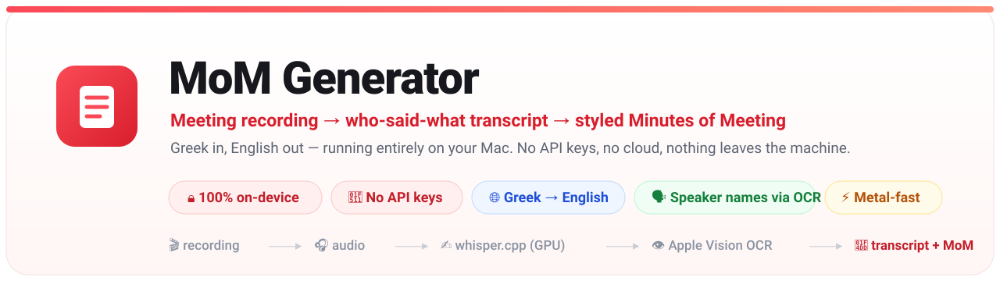
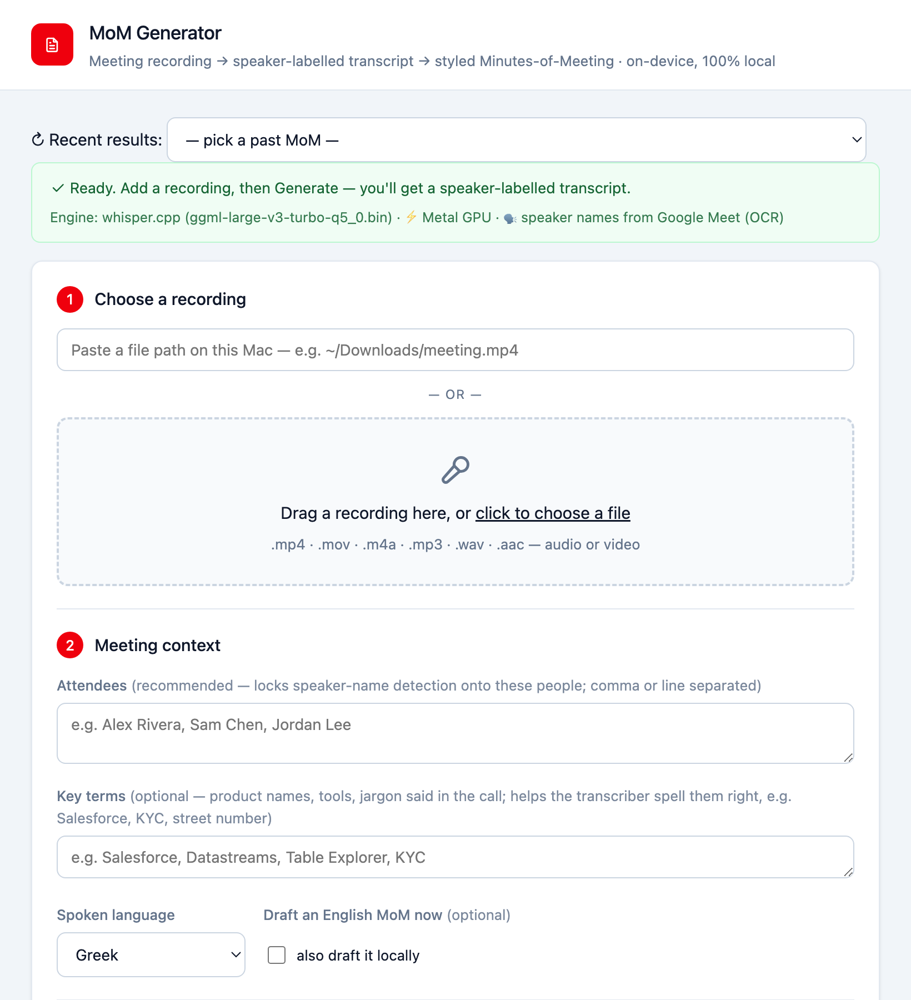

 

**Drop in a meeting recording. Get back a transcript that already knows who said what — plus a polished Minutes-of-Meeting email ready to paste into Gmail. Nothing leaves your Mac.**

 

The guided flow: ① choose a recording → ② add attendees & context → ③ Generate.

---

## ⬇️ Download & run (2 minutes, no terminal)

**[⬇️ Download the latest version (.zip)](https://github.com/sudockin/MoM-Greek-Generator/archive/refs/heads/main.zip)**  ·  [all releases & notes](https://github.com/sudockin/MoM-Greek-Generator/releases/latest)

1. **Unzip** the download (double-click it in Finder).
2. Double-click **`Install MoM Generator.command`** — installs everything (ffmpeg, the Greek speech model, Apple Vision OCR, Ollama). A few GB the first time, then permanent and offline.
3. Double-click **`Start MoM Generator.command`** — your browser opens the app.

> First launch, if macOS says *"unidentified developer"*: right-click the file → **Open** → **Open** (once). The installer clears this for you.
>
> **Requirements:** an Apple-silicon Mac (M1–M4) and ~15 GB free for the one-time model downloads.

---

## Why it exists

Recording a call is easy; turning it into shareable minutes is the slog — especially when the meeting is in **Greek** and you need clean **English** notes with the right person against every decision. Cloud transcription means uploading confidential internal calls and paying per minute.

**MoM Generator does the whole thing locally.** ffmpeg extracts the audio, whisper.cpp transcribes it on the Apple GPU, Apple's on-device Vision OCR reads the on-screen speaker names, and you get a speaker-labelled transcript — then a styled MoM, either via a ready-made Gemini prompt or a fully-offline local model. No API keys, no upload, no per-meeting cost.

## What you get

- 🗣️ **Knows who spoke.** Reads the active-speaker name straight off Google Meet / Teams video (Apple Vision OCR) and labels every line — real names, no account, no token. It never invents a name.
- 🌐 **Greek in → English out.** Transcribes Greek accurately; the minutes come out in clear business English.
- ⚡ **Fast.** Runs `large-v3-turbo` on the Metal GPU — roughly **10× faster** than the old CPU path, same Greek quality. A 40-minute meeting is done in a few minutes.
- 🎨 **Consistent, beautiful output.** Every MoM lands in the same styled email — subject line, title, attendee chips, "Latest status", discussion cards, and colour-coded 🚨 / 🔄 / 🛑 / ⏳ / ⬜ / ✅ action items, grouped into New, Carried Forward and Closed.
- 🧠 **Minutes that reason, not just summarise.** Every topic has to resolve — into a decision, or into the specific questions that must be answered first and who answers them. The critical path gets named, scope gets held, and re-opened decisions get their history restated. See [the quality standard](#-the-quality-standard) below.
- 🔒 **Private by construction.** Audio, transcript, and minutes never leave the laptop. The only network access is the one-time setup download.
- 🖥️ **No terminal required.** Two double-clicks: install, then run. Opens in your browser.

> **📸 The screenshot above** is a real capture of the running app
> ([`screenshots/app-ready.png`](screenshots/app-ready.png)), refreshed each release by
> [`./screenshots/capture.command`](screenshots/) — which also archives a versioned copy
> (`app-v1.2.png`). A hand-drawn vector fallback lives at
> [`screenshots/app-ui.svg`](screenshots/app-ui.svg).

---

## ▶️ Use it (you, right now)

0. *First time only:* double-click **`Install MoM Generator.command`** and wait for "All set!".
1. Double-click **`Start MoM Generator.command`** (keep the small window it opens). Your browser opens the UI.
2. **① Choose a recording** — drag one in (`.mp4 .mov .m4a .mp3 .wav .aac`) **or paste a
   file path** on this Mac (e.g. `~/Downloads/meeting.mp4`, which skips the upload).
3. **② Meeting context** — type the **Attendees** (recommended: this **locks speaker-name
   detection** onto the real people and kills false matches from shared-screen text).
4. **③ Generate.** When it's done you get a speaker-labelled transcript, a strip of
   **shared-screen screenshots** (untick any you don't want), and a choice of two ways
   to write the MoM:
   - **✨ Best quality — Google Gemini:** click **Copy Gemini prompt**, paste into Gemini,
     drag in the captured screenshots (the folder opens for you) → put the returned
     `SUBJECT:` line in Gmail's subject field and paste the styled HTML into the body.
   - **🔒 Private & offline:** click **Generate styled MoM** to draft it locally with your
     Ollama model — same styled email with the screenshots embedded, 100% offline, no
     tokens. Then **Copy for Gmail**.

Both paths produce the **same styled email** — subject line, title, attendee chips,
status box, discussion cards, and action items grouped into New / Carried Forward /
Closed — and both apply [the same reasoning standard](#-the-quality-standard). The
offline path shows the generated subject above the preview with a Copy button. A
bigger local model (`qwen2.5:14b`) gives richer offline drafts on a 24 GB Mac; the
reasoning rules ask more of the model, so on a 7B model expect the decomposition
and critical-path framing to be thinner than the Gemini path.

> **Before a long run**, the log prints a one-line **capability check** — engine in use,
> whether on-screen speaker names are possible, and whether audio diarization is available —
> so you know up front what to expect. Run `python3 server.py --self-check` for the same
> report without processing a file.

### 🖥️ Shared screens in the MoM (automatic, local)

Whatever was **presented** during the call becomes part of the notes. The same
on-device OCR pass that reads speaker names also spots when someone is sharing,
splits the share into distinct screens, and saves one screenshot per screen —
**cropped to the presented content** (the floating speaker tile and meeting
chrome are trimmed away, like Gemini's meeting notes).

On the results screen a **Shared screens** strip shows every capture; untick
anything that shouldn't reach the email. Ticked shots are embedded in the offline
MoM **inside the discussion point they belong to** (captioned with the timestamp
and who was presenting), and their on-screen text is included in the Gemini
prompt. Originals stay in `<output folder>/screenshots/`.

Tuning for unusual layouts (all optional): `MOM_SCREEN_MIN_BOXES`,
`MOM_SCREEN_MIN_CHARS`, `MOM_SCREEN_NEW_SIM`, `MOM_SCREEN_MIN_FRAMES`,
`MOM_SCREEN_MAX`, `MOM_SCREEN_TILE_MIN_X`.

### 🎥 Speaker names from the video (OCR — no token, no account)

For **video-call recordings** (Google Meet or Teams), the active speaker's name
is shown on screen. The app reads those names with Apple's on-device Vision OCR
and labels each line of the transcript with whoever was speaking — **real names**,
**no HuggingFace token and no account**. All local. Providing the **Attendees**
list makes this rock-solid: OCR only accepts names that match an attendee (it now
also matches single first names and `Name (Company)` tags).

After processing, a **Speaker names** panel shows the detected names; correct any
that look off and click **Apply names**. It never invents a name — segments it
can't read (e.g. during a screen-share) carry over the last known speaker. If OCR
can't run or matches nothing, the log says exactly why and you still get a clean
segmented transcript.

> The Greek speech model (**large-v3-turbo**, ~570 MB) is downloaded once during
> setup, then transcription is fully offline.

Results are also saved to `~/Documents/MoM Outputs/<recording-name>-<timestamp>/`
(transcript + MoM). To stop the app, close the small launcher window.

> Prefer the terminal? `python3 server.py` does the same thing, and
> `./run_mom.sh /path/to/recording.mp4` runs the whole pipeline headless.

---

## 🧭 The quality standard

Styling was never the hard part. The difference between a readable summary and
minutes people act on is **reasoning**, and it is now written into every prompt
path — the Gemini prompt, the offline JSON prompt, and both markdown prompts —
rather than living in the author's head.

Twelve rules, applied wherever the transcript supports them. The ones that change
the output most:

| | |
|---|---|
| **Every topic resolves** | A discussion point ends in a decision — or, when nothing was settled, in the *decomposition*: the specific questions that must be answered first, who answers each, and what approval is needed. "This was discussed" is named as the failure mode to avoid. |
| **Name the critical path** | Usually one open item gates the rest. The minutes say so in those terms, and that item is marked `Blocking` with an owner and a date. |
| **Keep the team un-idle** | When a decision waits on someone outside the room, the parallel track that runs meanwhile is recorded — and why. |
| **Hold scope** | What is in the MVP and what defers to a later phase are both stated. Deferral is a decision, recorded with its interim workaround. |
| **Restate re-opened history** | The prior decision, its date, and the reason it was taken — before re-litigating it. |
| **Ask for the number that decides** | "Some cases are complex" becomes an action item for the count or percentage, plus what that number decides. |
| **Be honest about the unknowable** | No invented confidence, no fabricated effort ranges. |
| **Ownership discipline** | Nothing commits DH/Central to a deliverable, date or capability the transcript doesn't show them committing to themselves. |

### 🚨 Blocking is not 🛑 Blocked

| | Meaning | Example |
|---|---|---|
| 🚨 **Blocking** | On the critical path. Other work waits on **this**. | "Confirm whether the domain is manageable by us." |
| 🛑 **Blocked** | Cannot start until something else is done. **This** is waiting. | "PoC build — gated on credentials." |

A MoM that marks both as "Blocked" tells the reader nothing about where to push.
⏳ **Awaiting** is the third case: sitting with a third party, nothing for us to do.

### Action items come in three groups

**New** → **Carried Forward** → **Closed**. Closed isn't padding — it's what shows
the ledger moving, and it's what lets the opening line say *"three open points
closed; two new items now sit on the critical path."* Empty groups are omitted.

> **[`examples/reference-mom.md`](examples/reference-mom.md)** is a full worked
> example at this bar, annotated with which rule each passage demonstrates, and
> ending with the same meeting written badly so the difference is concrete. Its
> content is fictional — this repository is public, so no real meeting material
> lives in it.

**Tuning the standard:** it lives in the `REASONING STANDARD` block, which appears
in `Gemini MoM Prompt.md` and three times in the Python (`MOM_JSON_INSTRUCTIONS`
and `PROMPT_TEMPLATE` in `server.py`, `PROMPT_TEMPLATE` in `summarize_mom.py`).
`test_speaker_naming.py` asserts all four stay in step and that the prompts and the
HTML renderer agree on every field name, so an edit can't silently start emitting
fields the template drops.

---

## 🤝 Share it with a colleague

Send them this **whole folder** (zip it). On their Mac, no commands needed:

1. Double-click **`Install MoM Generator.command`** — it installs everything
   (ffmpeg, whisper.cpp + the Greek model, Apple Vision OCR, and Ollama + qwen2.5:7b).
   A few GB of downloads the first time, then permanent and offline.
2. Double-click **`Start MoM Generator.command`** (keep the small window it opens).

If macOS says it's from an *unidentified developer*: right-click it →
**Open** → **Open** (only needed once). The installer clears this for you.

### Not included: YouTube / link transcription
Pasting a YouTube link is a **personal-use add-on that is deliberately left out of
this build** — it would download and run YouTube's remote challenge-solver code and
read your browser cookies, which isn't appropriate to ship to a shared/legal
audience. This build transcribes **files you provide**. (The person who shared this
can enable links on their own machine.)

### Optional: audio-only speaker separation
Video calls need nothing extra. For **audio-only** recordings, speaker labels
require pyannote diarization, which needs a free HuggingFace token saved to
`~/.cache/mom-generator/config.json` as `{"hf_token":"..."}` (accept the terms at
huggingface.co/pyannote/speaker-diarization-community-1). Not needed for Meet/Teams.

### Tuning OCR for unusual layouts
The name-detection geometry is overridable via env vars (`MOM_OCR_RIGHT_MIN_X`,
`MOM_OCR_TEAMS_MAX_X`, `MOM_OCR_MIN_H`/`MAX_H`, `MOM_OCR_BOTTOM_MAX_Y`,
`MOM_OCR_ROSTER_MIN`) if a particular meeting client places name tags differently.

---

## 🧩 What's in here

| File | Purpose |
|------|---------|
| `Install MoM Generator.command` | Double-click once to install everything |
| `Start MoM Generator.command` | Double-click launcher (starts the local web UI) |
| `server.py` | The web app + pipeline (Python standard library only — calls whisper.cpp/Ollama as subprocesses) |
| `ocr_speakers.py` | Reads on-screen speaker names from the video (Apple Vision OCR) |
| `summarize_mom.py` | Step 3 helper (transcript → MoM via Ollama) |
| `Gemini MoM Prompt.md` | The reusable prompt — the locked visual template **and** the reasoning standard |
| `examples/reference-mom.md` | Worked reference at the intended quality bar, annotated rule by rule (fictional content) |
| `run_mom.sh` | Headless CLI for the full pipeline |
| `setup.sh` | The actual installer (ffmpeg, whisper.cpp, Apple Vision OCR, Ollama, model) |
| `test_speaker_naming.py` | Unit tests for the OCR / model-discovery / overwrite-guard logic |
| `screenshots/` | Product screenshot + `capture.command` (regenerated each release) |
| `RELEASE_NOTES.md` | What's new, per version, with version history |
| `~/.cache/mom-generator/` | OCR/WhisperX venv + `config.json` (optional HuggingFace token) |

## 🔒 Privacy

Audio, transcripts, and minutes never leave the machine. whisper.cpp, the OCR, and
Ollama all run locally; the only network access is the **first-time** download of the
tools and models in `setup.sh`. Aligned with GDPR expectations for handling internal
meeting content.

## 🛠 Troubleshooting

- **Banner says a tool is missing** → run `./setup.sh`, then reload the page.
- **No speaker names on a video** → the log now says why (no `ocrmac`, 0 names matched,
  etc.). Add the **Attendees** list to lock detection onto real names.
- **"No Ollama model"** → `ollama pull qwen2.5:7b` (only needed for the offline MoM draft).
- **Empty transcript** → the audio may be silent or the wrong language; check the
  language dropdown.
- **Long meeting cut off** → the model context is 16k tokens (~1.5–2 hrs of
  speech). For longer recordings, ask for chunking to be enabled.
